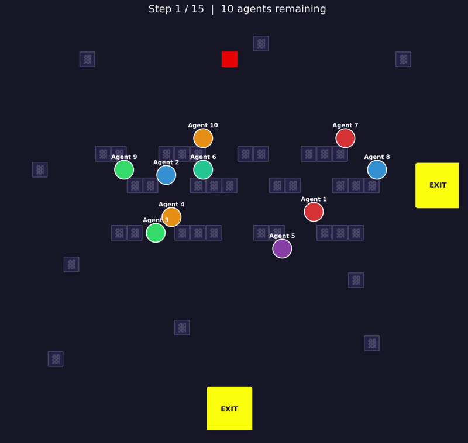

# Realistic Fire Evacuation Simulator (LLM Agents + Mesa)

This project simulates a fire evacuation scenario where each human is represented by an LLM-driven agent.

The environment is built with [Mesa](https://mesa.readthedocs.io/), and agent cognition/decision-making is implemented with [Mesa-LLM](https://github.com/projectmesa/mesa-llm). Agents navigate a constrained space with doors, obstacles, and spreading fire while trying to survive and exit.

## Demo


## Recognition
3rd Place at Agentic Hackathon Zurich (DeepMind x Vercel x ASL).

## What This Simulator Includes
- Grid-based evacuation environment (`MultiGrid` via Mesa)
- Multiple exits (doors)
- Obstacles and blocked cells
- Random initial fire seeding
- Fire spread over time with configurable probability
- Fire contact = agent death
- LLM-based agent movement decisions under local observations
- Trajectory export (`trajectory.json`) and animation replay

## Quick Start
```bash
# 1) Install dependencies
poetry install

# 2) Set your API key
echo "OPENAI_API_KEY=sk-..." > .env

# 3) Run a simulation
python -m simulation.run

# 4) Replay trajectory
python -m simulation.visualize
```

## Configuration
Main config file: [configs/agents.yaml](configs/agents.yaml)

Example:
```yaml
environment:
  width: 30
  height: 30
  deadline: 15
  llm_model: "openai/gpt-5.2"
  num_agents: 10
  random_seed: 42
  agent_name_prefix: "Agent"
  fire:
    num_initial_fires: 2
    spread_probability: 0.18
    random_seed: 42
  doors:
    - [29, 15]
    - [15, 0]
  obstacles:
    - [8, 12]
    - [9, 12]
    # ...
```

## Core Files
- `simulation/model.py`: environment dynamics (doors, fire, death, termination)
- `simulation/agent.py`: LLM agent reasoning/step logic
- `simulation/tools.py`: agent action tools
- `simulation/run.py`: config loading, random agent generation, simulation execution, trajectory export
- `simulation/visualization.py`: Matplotlib replay
- `simulation/visualize.py`: replay entrypoint

## Outputs
Running `python -m simulation.run` produces:
- `trajectory.json` with:
  - `width`, `height`
  - `door_positions`
  - `obstacles`
  - `history` (positions per step)
  - `status_history` (`active` / `exited` / `dead`)
  - `fire_history` (fire cells per step)

## Acknowledgements
- [Mesa](https://mesa.readthedocs.io/) for the agent-based modeling framework.
- [Mesa-LLM](https://github.com/projectmesa/mesa-llm) for LLM-integrated ABM patterns/tools.
- OpenAI-compatible model endpoints (via project configuration) for agent cognition.

## Citation
If you use this project in research, please cite Mesa:

- ter Hoeven, E., Kwakkel, J., Hess, V., Pike, T., Wang, B., rht, & Kazil, J. (2025). *Mesa 3: Agent-based modeling with Python in 2025*. Journal of Open Source Software, 10(107), 7668. https://doi.org/10.21105/joss.07668

BibTeX:
```bibtex
@article{terHoeven2025mesa3,
  author = {ter Hoeven, Ewout and Kwakkel, Jan and Hess, Veronika and Pike, Thomas and Wang, Bowen and rht and Kazil, Jackie},
  title = {Mesa 3: Agent-based modeling with Python in 2025},
  journal = {Journal of Open Source Software},
  year = {2025},
  volume = {10},
  number = {107},
  pages = {7668},
  doi = {10.21105/joss.07668},
  url = {https://doi.org/10.21105/joss.07668}
}
```
